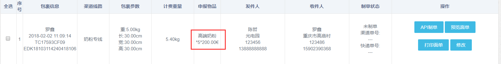
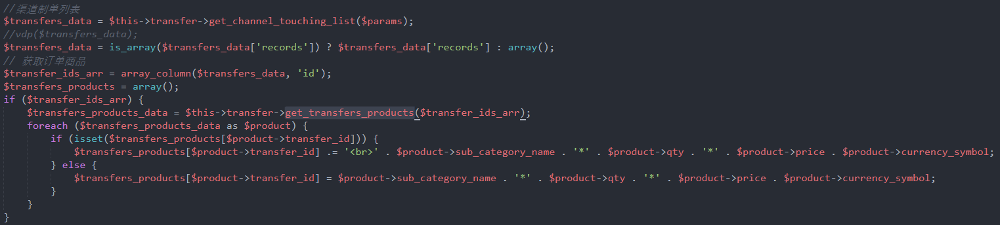
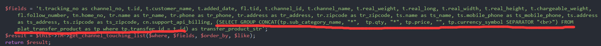
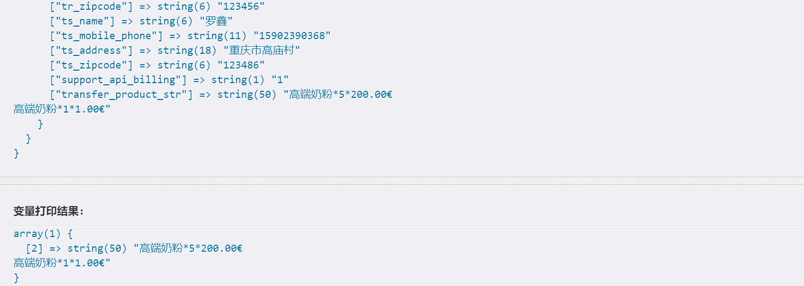

## 上周codereview执行结果回馈
1. <span class="attention">GROUP_CONCAT</span>用法
> 

<a href="#" id="show_group_concat_intro">解决方式</a>
> <p id="how_use_group_concat" class="hidden" >
    
    
    <a href="http://blog.csdn.net/aya19880214/article/details/41280893" target="_blank">GROUP_CONCAT用法</a>
> </p>

2.
```php
// library/warehousex
// 结束批次
$result = $this->CI->warehouse_clerk_transfer_model->output($transport->id);

// model/Warehouse_clerk_transfer_model
// 结束批次
public function output($batch_id) {
    // 关闭批次之前的操作....

    //2. 关闭批次
    $where = array(
        'id' => $batch_id
    );
    $set = array(
        'status'          => 0,
    );
    $this->update_from($this->_transport_table, $where, $set);

    // 关闭批次之前的操作...

    // 事务结束
    $this->db->trans_complete();
    if ($this->db->trans_status()) {
        return TRUE;
    } else {
        return FALSE;
    }
}
```

## 讨论上周遇到的问题
* <span class="attention">@余林</span>准备演示局部刷新代码
* <span class="attention">kuai</span>和<span class="attention">EDK</span>、<span class="attention">FR</span>对接问题。
> <span class="attention">kuai</span>的数据来源于<span class="attention">项目</span>的订单状态和<span class="attention">kuaidi100</span>，如果需要在<span class="attention">项目</span>的状态上添加一些额外的信息，这个添加应该是在<span class="attention">项目</span>中由项目自己完成。


## 项目进度

## 分享
* 学习HTML5和CSS3讲解（安平）
<a href="../assets/attchment/2018-02-05/html5&css3.rar" download="html5&css3">html5&css3.rar</a>

## 备注

## 周会记录

