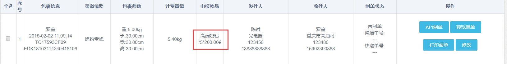
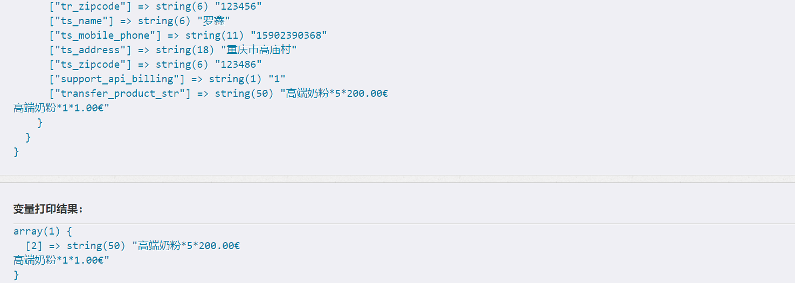

## 上周codereview执行结果回馈
1. `GROUP_CONCAT`用法
> 

<a href="#" id="show_group_concat_intro">解决方式</a>

    
    
    <a href="http://blog.csdn.net/aya19880214/article/details/41280893" target="_blank">GROUP_CONCAT用法</a>

## 讨论上周遇到的问题
* `@余林`准备演示局部刷新代码
* `kuai`和`EDK`、`FR`对接问题。
>`kuai`的数据来源于`项目`的订单状态和`kuaidi100`，如果需要在`项目`的状态上添加一些额外的信息，这个添加应该是在`项目`中由项目自己完成。

## 项目进度

## 分享
* 学习HTML5和CSS3讲解（安平）
<a href="../assets/attchment/2018-02-05/html5&css3.rar" download="html5&css3">html5&css3.rar</a>

## 备注

## 周会记录

