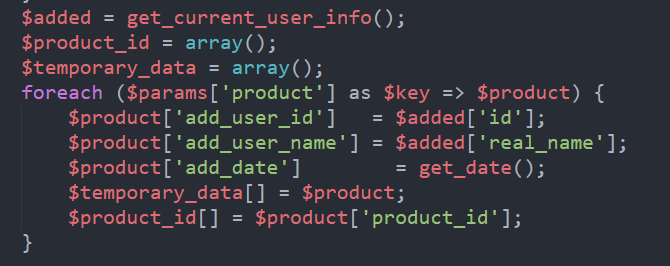
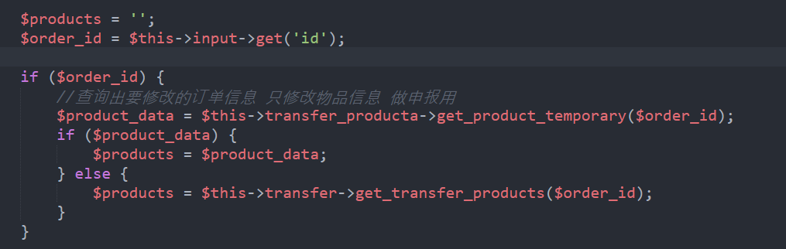
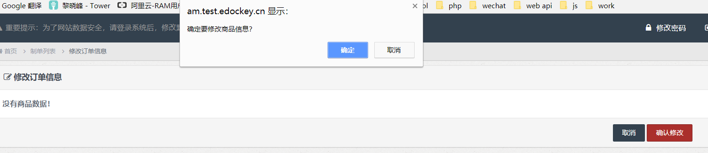

## 上周codereview执行结果回馈
* 代码重构，详见：http://am.test.edockey.cn/warehouse_user
    * JS相关代码

```js
    $('.j_collect_earn').on('blur',function() {
        clear_error();
        var ev = $(this);
        var status = 'ji';
        var validated = vaxx.user_earn(ev,status);
        if (!validated.result) {
            //显示错误
            alert(validated.errors);
            return false;
        }
        var old_earn = parseFloat(ev.attr('code_earn'));
        var earn = parseFloat(ev.val());
        if(old_earn != earn ) {
            var url = 'warehouse_user/user_earn';
                params = {
                    type: 'post',
                    data: validated.data,
                },
                callback = function(res) {
                    if (res == 1) {
                        var earn_2 = earn.toFixed(2);
                        ev.val(earn_2);
                        ev.attr('code_earn', earn_2);
                        ev.attr('value', earn_2);
                        alert('修改成功');
                    }
                };
            http.ajax(url,params,callback);
        }
    });

    $('.j_storages_earn').on('blur',function() {
        clear_error();
        var ev = $(this);
        var status = 'ru';
        var validated = vaxx.user_earn(ev,status);

        if (!validated.result) {
            //显示错误
            alert(validated.errors);
            return false;
        }
        var old_earn = parseFloat(ev.attr('code_earn'));
        var earn = parseFloat(ev.val());
        if(old_earn != earn ) {
            var url = 'warehouse_user/user_earn';
                params = {
                    type: 'post',
                    data: validated.data,
                },
                callback = function(res) {
                    if (res == 1) {
                        var earn_2 = earn.toFixed(2);
                        var earn_1 = old_earn.toFixed(2);
                        ev.val(earn_2);
                        ev.attr('code_earn',earn_1);
                        alert('修改成功');
                    }
                };
            http.ajax(url,params,callback);
        }
    });

    $('.j_output_earn').on('blur',function() {
        clear_error();
        var ev = $(this);
        var status = 'cu';
        var validated = vaxx.user_earn(ev,status);

        if (!validated.result) {
            //显示错误
            alert(validated.errors);
            return false;
        }
        var old_earn = parseFloat(ev.attr('code_earn'));
        var earn = parseFloat(ev.val());
        if(old_earn != earn ) {
            var url = 'warehouse_user/user_earn';
                params = {
                    type: 'post',
                    data: validated.data,
                },
                callback = function(res) {
                    if (res == 1) {
                        var earn_2 = earn.toFixed(2);
                        var earn_1 = old_earn.toFixed(2);
                        ev.val(earn_2);
                        ev.attr('code_earn',earn_1);
                        alert('修改成功');
                    }
                };
            http.ajax(url,params,callback);
        }
    });
```
    * php相关代码

```php
    public function user_earn($post) {
        $id = $post['clerk_id'];

        if ($post['status'] == 'ji') {
            $ji_earn = array(
                'collect_earn' => $post['earn_money'],
            );
            $result = $this->CI->warehouse_clerk_model->update($id, $ji_earn);
        } else if($post['status'] == 'ru') {
            $ru_earn = array(
                'storages_earn' => $post['earn_money'],
            );
            $result = $this->CI->warehouse_clerk_model->update($id, $ru_earn);
        } else if($post['status'] == 'cu') {
            $cu_earn = array(
                'output_earn' => $post['earn_money'],
            );
            $result = $this->CI->warehouse_clerk_model->update($id, $cu_earn);
        }
        return $result;
    }
```
* 报错，云仓页面点击，详见http://am.test.edockey.cn/warehouse/edit?company_id=2&id=1&inlet=1

* transfer_producta/update_transfer_product
    * 
    * transfer_producta是什么


* chamber_order/edit
    * 
    * 弹窗内容
      

## 分享
1. <span class="attention">@罗鑫</span>分享GROUP_CONCAT用法

## 项目进度

## 备注

## 周会记录


