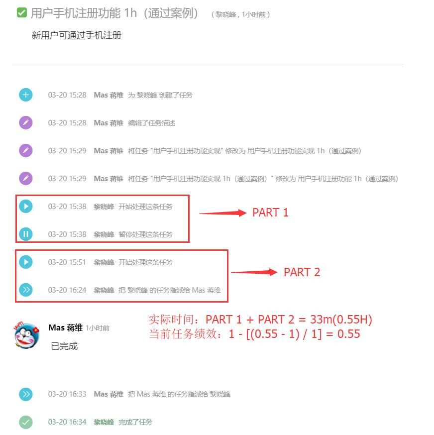
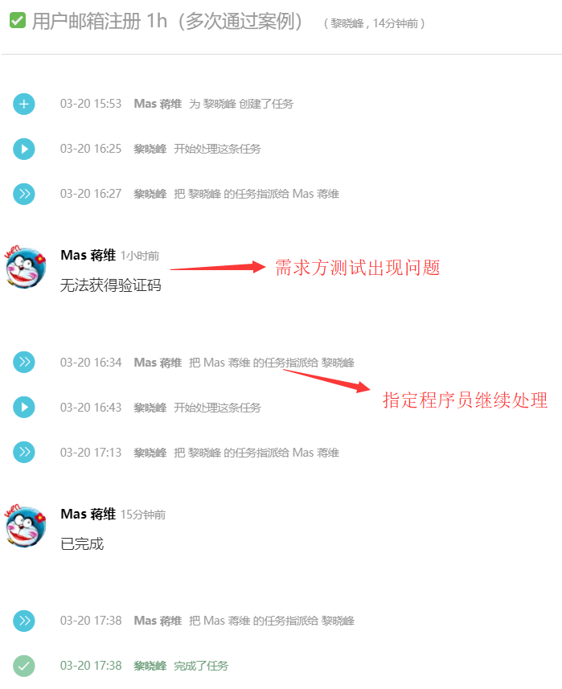

# 绩效说明

## 计算方式

* 每个任务的绩效：`1 - (实际时间 - 预估时间) / 预估时间` 即是 `1 - (S-Y)/Y`；
* 当周绩效：`当周已完成的每个任务绩效之和 / 已完成任务数量`；
* 当月绩效：一个月按照4周来分，每周占25%，当周的效率 * 25%即是当周的绩效，累计4周的为当月的绩效；
> 例子：
某周已完成任务如下： 
    任务1： 预估3H 实际2H ----> 当前任务绩效 1 - [(2 - 3) / 3] = 1.33 
    任务2： 预估4H 实际7H ----> 当前任务绩效 1 - [(7 - 4) / 7] = 0.57 
当周的的绩效如下： 
    (1.33 + 0.57) / 2 = 0.95 
当月的绩效如下： 
    第一周绩效 + 第二周绩效 + 第三周绩效 + (0.95 * 25 = 23.75) 

## 绩效说明
1. 我和组长提前一周制定或分配下周开发任务，每周五周会公布下周任务（如有疑问下周一前提出商讨）；
3. 每个人自行安排当周开发任务（和他人任务相关的需求，安排在最开始的位置）；
6. 开发人员不得调整需求既定的完成时间（需求方添加需求请通知到我或者组长）；
4. bug不算加急任务，请bug maker立即解决；
8. 完成任务后自行统计当前任务的实际耗时记录于任务流程中；
8. 任务完成需由需求方认可。
> 例子：1

例子：2

7. 任务说明：
* 正常任务：说明略
> 描述形式：`任务描述XXXXXXXXXXX 预估3H` 帅鑫 下周五
* 加急任务：加急任务由加急方提出并给出需求时间，同时当周剩余任务依次后延，若加急需求当周不能达成则当周只将已完成的任务用于计算达成率，若当周已完成了加急需求则加急需求算入本周计算达成率
> 描述形式如：`加急！任务描述XXXXXXXX 预估3H` 帅彬 下周五

