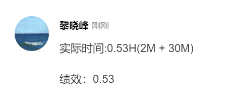

# 绩效说明

## 计算方式

* 每个任务的绩效：`1 - (实际时间 - 预估时间) / 预估时间` 即是 `1 - (S-Y)/Y`；
* 当周绩效：`当周已完成的每个任务绩效之和 / 已完成任务数量`；
* 当月绩效：一个月按照4周来分，每周占25%，当周的效率 * 25%即是当周的绩效，累计4周的为当月的绩效；
> 例子：
某周已完成任务如下： 
    任务1： 预估3H 实际2H ----> 当前任务绩效 1 - [(2 - 3) / 3] = 1.33 
    任务2： 预估4H 实际7H ----> 当前任务绩效 1 - [(7 - 4) / 7] = 0.57 
当周的的绩效如下： 
    (1.33 + 0.57) / 2 = 0.95 
当月的绩效如下： 
    第一周绩效 + 第二周绩效 + 第三周绩效 + (0.95 * 25 = 23.75) 

## 绩效说明
1. 我和组长提前一周制定或分配下周开发任务，每周五周会公布下周任务（如有疑问下周一前提出商讨）；
3. 每个人自行安排当周开发任务（和他人任务相关的需求，安排在最开始的位置）；
6. 开发人员不得调整需求既定的完成时间（需求方添加需求请通知到我或者组长）；
4. bug不算加急任务，请bug maker立即解决；
8. 完成任务后自行统计当前任务的实际耗时记录于任务流程中；
9. 日常任务一般不设置完成时间，除非**有明确要求截止时间的**或者**需要配合他人完成的任务**，设置了完成时间请严格按照时间执行；
8. 任务完成（完成是指本地测试线上测试后均无问题）需由需求方认可。
10. 任务完成造成了新的bug也算在当前任务中
11. 如果出现长时间要处理其他事物（比如开会等），若在任务中留言或者暂停的形式体现，若未在处理任务则可以通过新建一个tower体现只是不计入绩效
>
例子：一次通过案例 
 
例子：多次通过案例 
 
例子：完成任务绩效的填写方式 

7. 任务说明：
* 正常任务：说明略
> 描述形式：`任务描述XXXXXXXXXXX 预估3H` 帅鑫 下周五
* 加急任务：加急任务由加急方提出并给出需求时间，同时当周剩余任务依次后延，若加急需求当周不能达成则当周只将已完成的任务用于计算达成率，若当周已完成了加急需求则加急需求算入本周计算达成率
> 描述形式如：`加急！任务描述XXXXXXXX 预估3H` 帅彬 下周五

## 补充说明
### **V1.1**
* 自五月开始目标绩效调整为110%
* 在绩效中引入bug率，占总绩效的20%（任务完成率80%、bug率20%）
	* 完成的任务提交给需求方（或者审核人）发现的bug才算
	* EDK项目的容错率为40%，FR和COM项目为30%
	* 容错率计算：每人当月bug总数量 / 任务总个数，超过容错率20%全扣，未超过全得
	* 何安平记录一个月的bug数量
* 需求交流完后，做好会议记录，并且用自己的话描述一遍，并且在放置tower上

### **V1.2**
* 开发流程中发现的bug如果不能马上处理，那么需要提交tower，否则视为当前任务的bug
* 在任务检查中如果发现bug请在当前的tower的时间内完成
* 如果需求或者代码有优化余地另外开通tower计算完成
* 针对较大的需求（比如新添药妆专线）会设置截止时间，任务的绩效公式不变，只是单位调整成天数，以需求创建日期开始，到截止时间的天数作为预估时间。

## 周会记录
* <a href="../assets/attchment/2018-03-16/mk_content.docx" download="周会记录.docx">周会记录</a>

