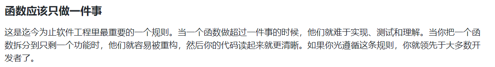
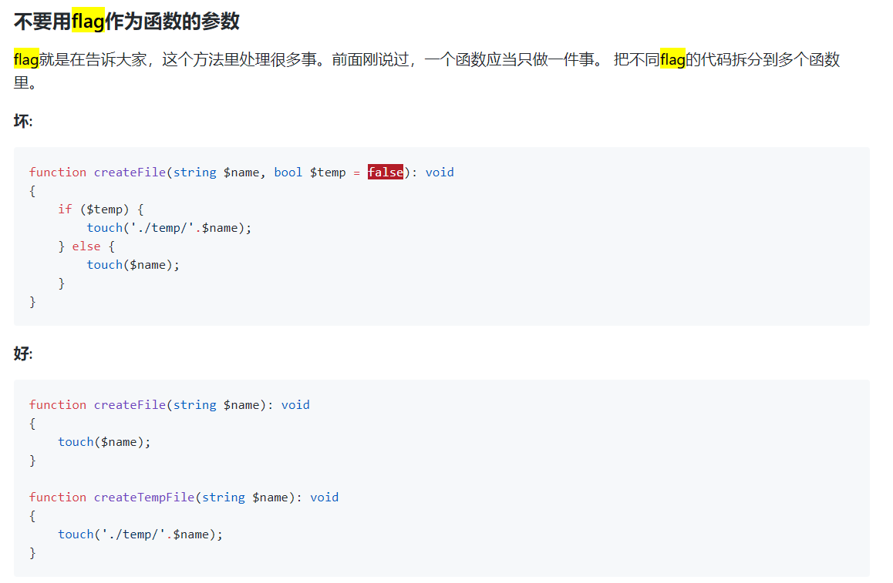

## 上周codereview执行结果回馈
> 希望了解的

* 函数应该只做一件事

* 不要用flag作为函数的参数

* 期望当中最好的方法是那种，或者觉得最好用的方法是哪个？
	<!-- 用什么东西，来做什么事情，做的结果  `isExistName($name);`-->

* 好的函数
 1.良好的复用性
 2.良好的扩展性
 3.良好的维护性
 4.良好的可读性

## 绩效追踪
> 工作的时间做工作相关的事情

## 分享
> 遇到大坑小坑常做记录，周会分享，大家学习，共同进步

* `adi-fr\app\views\admin\merchant\edit_merchant` 余林分享这种js的写法(yulin)
* 陈喆对比面向对象和面向过程的优势劣势
* `edockey\shared\libraries\Exporter\Excel\ClearanceExporter` 李彬思考 ClearanceExporter->get_data() 如何避免循环查询
* 关于功能说明和交接

> 余林： 1. 介绍一下背景
        2. 说明一下现有流程
>
现有需求发起流程是缺失或者说是有问题，问题如下：
 1. 目前的发起方式基本是通过QQ和微信，会造成需求从发起到结束中间过程不易追溯的问题；
 2. 需求的发起和结束，都是单对单的；
 3. 需求功能开发完成后，相关伙伴不清楚有该需求或者说并不了解需求的功能；
针对以上问题做如下调整：
 1. 以后需求的发起（包括添加删除后台伙伴权限）都需要通过邮件形式发起；
 2. 发起需求的邮件中需要描述需求的具体内容，并发送给开发伙伴（FR相关需求发给余林yulin_forest@qq.com，COM的发送给我，EDK相关的发给陈喆540882814@qq.com ），抄送给王总（ivan@adiexpress.com）；
 3. 开发伙伴完成开发后，针对发起邮件回复需求功能的使用说明；需求发起人获得回复后需要通知到相关伙伴（通知方式建议通过邮件和办公及时通讯工具（QQ或微信）两种方式并存）；

## 项目进度
> 会前整理好本周的工作，体现出可实施性。

## 周会记录

## 备注
* 讨论 如何用框架使用的 `OR WHERE` VS `$this->db->or_where`
* 罗鑫准备`封装` 什么是封装，何时需要封装，封装的内容，怎么封装

