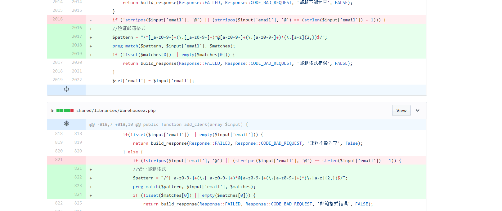
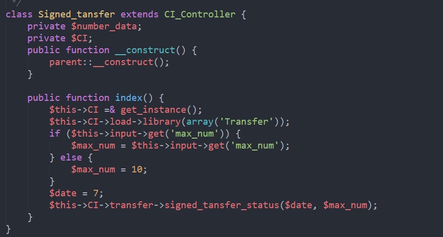

## 上周codereview执行结果回馈





## 分享
> 遇到大坑小坑常做记录，周会分享，大家学习，共同进步

* 罗鑫 IOS兼容问题 | haystack needle怎么读
<a href="../assets/attchment/2018-05-25/lx_share.rar" >点击下载</a>

* 黎晓峰 json_decode()遇到的问题

<!--
	json_decode() 的用法介绍

	起因背景，陈喆，EDK开单的接口提示报错 ‘参数不能为空’
	(简单介绍 api到调用方法的过程)
	那么首先就找到哪些地方有 参数不能为空，'定位'到问题
	于是加入日志，想看看json但是发现同样的代码就是没得失败的那个json的数据
		json什么样子
		错误到底在哪里
 -->
```json
{"access_key_id":"VYMzDjQNi0MONYDO","timestamp":1526988891,"channel_code":"milk","total_weight":6.6,"total_price":864,"head":{"order_number":"SQ500021351","tracking_number":"","shipping_amount":224.59,"purchaser_name":"曲 雯琳	","purchaser_cardid":"610103199002042845","consignee_name":"曲 雯琳	","consignee_phone":"17791879217","consignee_email":"zhangyueming.sylvia@hotmail.com","consignee_province":"陕西省","consignee_city":"西安市","consignee_county":"凤城九路桦林间北门2号楼2单元 ","consignee_address":"未央区","consignee_zipcode":"710018","sendername":"zhang yueming","senderphone":"0142213737","senderaddress":"318 residence les ecrivains 2 rue jean anouilh","awbno":"","exchange_rate":""},"items":[{"title":"Gallia 1段近母乳900g","price":"144","ean":"3","quantity":"6","link":""}],"signature":"79c43489fb07899997d479b736a53005"}
```
<!--
	定位问题，报错描述准确有助于定位错误
	json_decode() 不能包含tabs
	sublime text 3 编辑器转换了tabs空格
-->


## 绩效追踪
> 工作的时间做工作相关的事情

* 任务完成率

|  姓名  | 占当月 |
|--------|------|
| 余林   |12.50%|
| 何安平 |27.00%|
| 陈喆   |29.46%|
| 李彬   |31.13%|
| 罗鑫   |31.16%|

* bug率
 * 陈喆 3个端验证用户名不能包含@符号
 * 罗鑫 云仓站内信页面最后的数据不能展示 0.5H
 * 黎晓峰 EDK api开单的json字符串中若含有tabs，那么json_decode将解析不出来返回null


## 项目进度
> 会前整理好本周的工作，体现出可实施性。

* EDK
	* 调整上周测试出现的问题
	* UI讨论结果
* FR：
	* 周一早上给出对接EDK订单预估时间
	* 邮件中的内容
	* 提出BUG的整改
	* 导入奶粉渠道备案商品功能，导入失败


## 周会记录
* <a href="../assets/attchment/2018-05-25/mk_content.docx" download="周会记录.docx">周会记录</a>


## 备注
* 讨论 如何用框架使用的 `OR WHERE` VS `$this->db->or_where`
* 罗鑫 继续总结如何调试ios兼容性的问题并分享
* 李彬 uploadfive 的使用介绍


