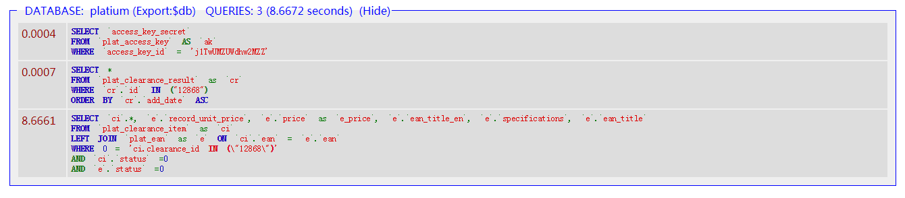
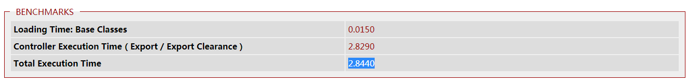
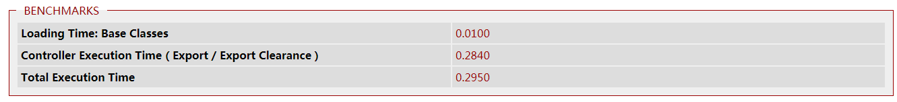

## 上周codereview执行结果回馈

## 分享
> 遇到大坑小坑常做记录，周会分享，大家学习，共同进步

* <a href="https://codeigniter.org.cn/user_guide/libraries/output.html?highlight=enable#CI_Output::enable_profiler" target="_blank">关于调试的小方法</a>

 

 

<!-- 1.现像 -->
<!-- 2.定位问题 -->

<!-- 3.方法 -->
<!-- 4.解决 -->

## 绩效追踪
> 工作的时间做工作相关的事情

* 任务完成率

## 项目进度
> 会前整理好本周的工作，体现出可实施性。

* EDK：

* FR：

## 周会记录

## 备注
* 罗鑫 继续总结如何调试ios兼容性的问题并分享
* 罗鑫 hide, prop hidden 的区别
* 李彬 数组函数问题的解答
